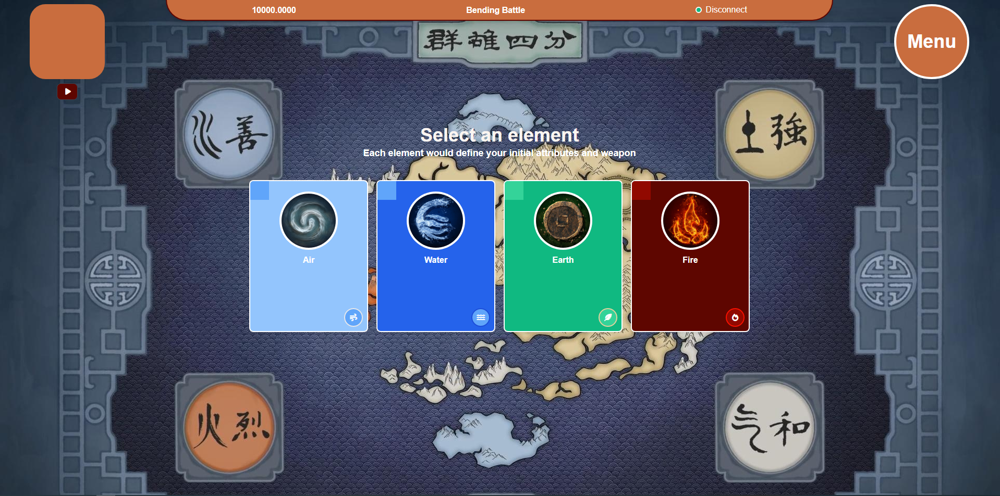
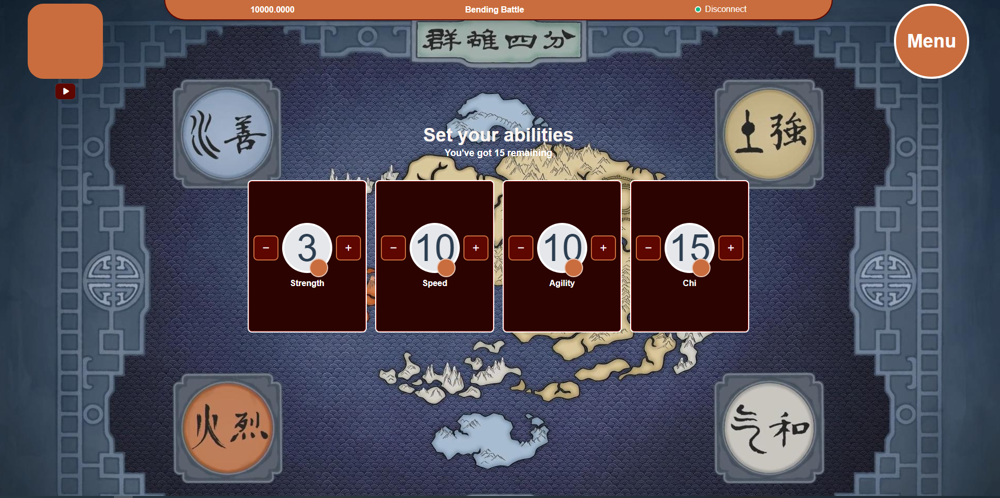

# Bending Battle

Web3.0 card game inspired in Avatar - The Legend of Aang





## User Stories

- User Story: I can connect my wallet using metamask.

- User Story: I can create my Bender NFT.

- User Story: I can fight another Bender owned by other users.

- User Story: I can see my tokens and Benders on Sell.

- User Story: I can buy and sell Benders

## Technical Details
In the following application tried to cover all main aspects of solidity and smart contract topics

- Use external contracts and libraries
- Protect external configuration functions with Ownable
- Implement ERC721 Interface
- Market
- Testing the contracts

In addition to the following Dapp topics

- Connecting a wallet (Metamask)
- Connect a frontend with a smart contract (ethers.js)
- Listen events from the contracts
## The contracts

| Contract                 | Description                                      |
|--------------------------|-----------------------------------------         |
| **BenderBase.sol**       | Stores Bender related functionality              |
| **BenderBending.sol**    | Stores Attack related functionality              | 
| **BenderHelper.sol**     | Stores Bender creation and fetching              | 
| **BendingGamePlay.sol**  | Stores the game functionality (levels, fighting) | 
| **BendingNFT.sol**       | Stores the ERC721 implementation                 | 
| **BendingNFTMarket.sol** | Stores the market place                          | 

## Built with
Frontend:
- [Vue.js 3](https://v3.vuejs.org/) - The Progressive JavaScript Framework
- [ethers.js](https://docs.ethers.io/v5/) - JS library for interacting with the Ethereum Blockchain and its ecosystem


Blockchain Environment:
- [Hardhat](https://hardhat.org/) - Flexible, extensible and fast Ethereum development environment for professionals.

## Installation

### Prerequisites

| Prerequisite                                          | Version |
| ------------------------------------------------------| ------- |
| [MetaMask](https://metamask.io/)                                          |         |
| npm (comes with Node) or yarn (used)                  | `~ ^12.20.0`|
| npm (comes with Node) or yarn (used)                  | `~ ^6.14.8`  |

```shell
node -v
mongo --version
```
#### Cloning the repo

1. Open a Terminal in your projects directory 
2. Clone this repo

```shell
$ git clone https://github.com/jesusantguerrero/bending-battle.git
```

### setup
```bash
# Install NPM dependencies
npm run project:setup
# or If you like yarn
yarn project:setup

```
under the hood this runs an `npm install` in the root then moves to `/frontend` and run an `npm install`   

copy .env.example to .env and change the API KEY:

```bash
# Remember place your alpha vantage API_KEY there:
cp .env.example .env
```

### running

```bash
# Start the local blockchain in a separate terminal
npm run serve

# Deploy the contracts to the local blockchain
npm run deploy

# run the frontend SPA
npm run dev
```

